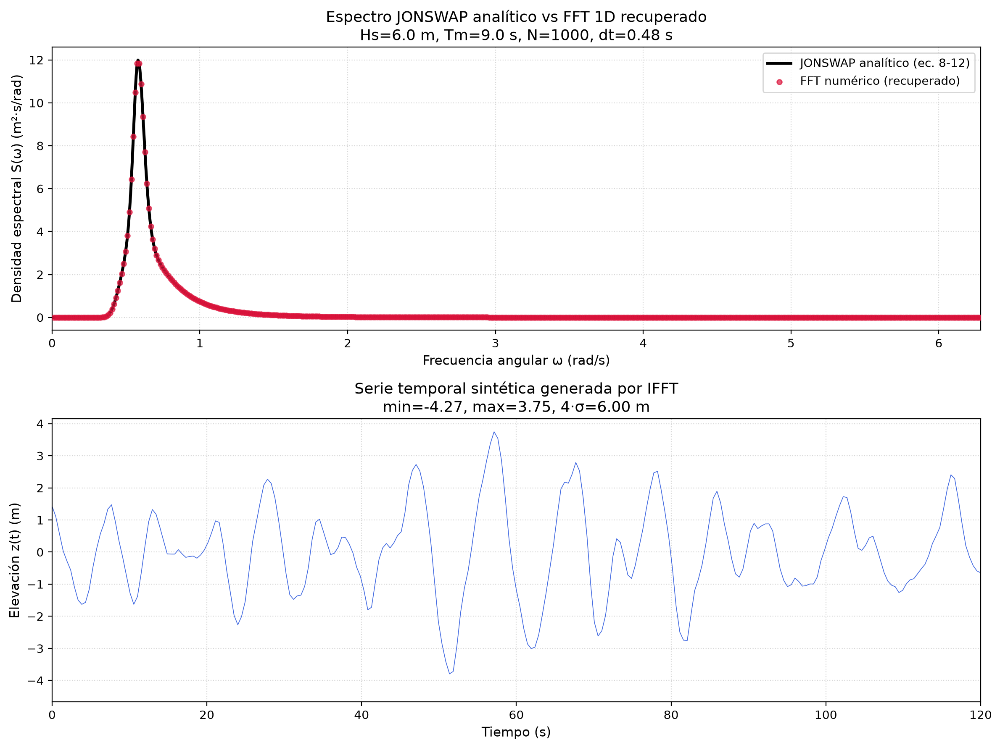
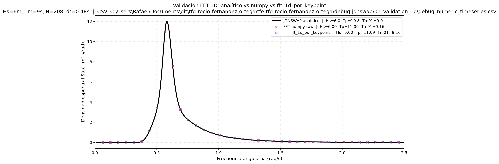

# 01 — Validación FFT 1D (espectro unidimensional)

**Objetivo:** Verificar que la FFT 1D recupera correctamente el espectro
JONSWAP a partir de una serie temporal sintética. Es el test más básico:
1 solo punto, sin direcciones, sin spreading.

Parámetros: **Hs = 6 m, Tm = 9 s, dt = 0.48 s**.

---

## Pipeline

### Paso 1 — Generar serie temporal sintética

```bash
python debug_spectrum_numeric_write_csv.py
```

Toma el espectro JONSWAP analítico (ec. 8-12 de SeaFEM), genera fases
aleatorias, construye amplitudes $A_i = \sqrt{2 \cdot S(\omega_i) \cdot \Delta\omega}$
y aplica IFFT para obtener $z(t)$. Guarda:

- `debug_numeric_timeseries.csv` — serie temporal (`Tiempo_s`, `z_m`)
- `debug_analytical_spectrum.csv` — espectro de referencia (`omega_rad_s`, `S_m2_s_rad`)

### Paso 2 — Validar FFT contra el analítico

```bash
python csv_fft_plot.py
```

Lee la serie temporal, aplica FFT con **numpy puro** y con
`fft_analisis.fft_1d_por_keypoint` (duplicando la señal en 24 KPs),
y compara ambas contra el espectro analítico.

### Paso 3 (alternativo) — Todo en uno

```bash
python debug_spectrum.py
```

Genera espectro → IFFT → FFT en un solo script. Produce `debug_spectrum.png`.

---

## Lo que se observó

La FFT (puntos rojos/azules) sigue perfectamente la curva analítica (línea negra).
Esto confirma que la FFT 1D está bien implementada y que el escalado
($2/N$ para amplitud unilateral, $A^2/(2\Delta\omega)$ para densidad espectral)
es correcto.



> **Nota:** Durante la validación se encontró un bug de escalado IFFT→FFT
> (factor ×4). Está documentado en `DEBUG_SPECTRUM_NOTE.md` y ya fue corregido.



