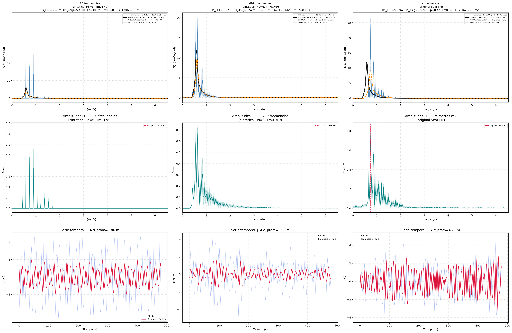

# 03 — Comparación: datos sintéticos vs original SeaFEM

**Objetivo:** Comparar el espectro FFT de los datos sintéticos (generados con
parámetros conocidos: Hs=6, Tm01≈9) contra el `z_metros.csv` original de
SeaFEM, para diagnosticar discrepancias.

## Pipeline

### Paso 1 — Comparativa principal (3 columnas)

```bash
python compare_nfreqs.py
```

Genera CSVs sintéticos con **10 y 499 frecuencias**, calcula la FFT en ambos
y en `z_metros.csv`, y muestra una comparativa de 3 columnas. En cada columna:
- **Azul** = FFT numérico (promedio 24 KPs)
- **Negro** = JONSWAP con parámetros objetivo (Hs=6, TM_FORMULA=9)
- **Naranja** = JONSWAP con parámetros estimados de la propia FFT
- **Gris** = espectro analítico de referencia



### Paso 2 (opcional) — Comparaciones individuales

```bash
python csv_fft_plot_prediction.py   # solo original vs analítico
python csv_fft_plot_synthetic.py    # solo sintético vs analítico
```

---

## Lo que se observó

| | 10 frec (sintético) | 499 frec (sintético) | z_metros.csv (original) |
|---|---|---|---|
| **Hs_FFT** | 5.48 m | 5.52 m | **5.97 m** |
| **Hs_4σ** | 5.42 m | 5.52 m | **5.97 m** |
| **Tp** | 10.91 s | 10.21 s | **8.42 s** |
| **Tm01** | 8.83 s | 8.66 s | **7.13 s** |

> Nota: spreading con soporte compacto $\cos^6(\pi t/2)$, $\pm 45°$, $s=3$.

1. **El método FFT funciona.** Con datos sintéticos (columnas 1 y 2),
   el espectro recuperado coincide con el JONSWAP de entrada.
2. **`z_metros.csv` NO se generó con Hs=6, Tm01=9.** Su Tp=8.4s y
   Tm01=7.1s corresponden a un JONSWAP con periodo más corto (~7-8s).
3. **El filtro de 0.33 Hz no afecta.** La energía por encima es despreciable.
4. **El bug de Jensen** (promediar amplitudes antes de elevar al cuadrado)
   fue corregido en estos scripts. `fft_analisis.py` no lo tiene
   (calcula Hs por KP individualmente).
